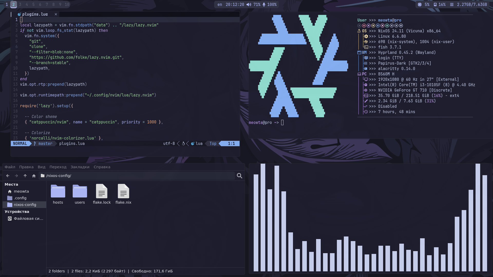

<h1 align="center">❄️ My NixOS Config</h1>

<p align="center">
  </br>
  
  
  
  </br>
</p>

## 📚 About



</br>

 * OS: [**`NixOS`**](https://nixos.org/)
 * WM: [**`Hyprland`**](https://hyprland.org/)
 * Bar: [**`Waybar`**](https://github.com/Alexays/Waybar)
 * Terminal: [**`Alacritty`**](https://github.com/alacritty/alacritty)
 * Shell: [**`Fish`**](https://github.com/fish-shell/fish-shell)
 * Notify Daemon: [**`Dunst`**](https://github.com/dunst-project/dunst)
 * App Launcher: [**`Rofi`**](https://github.com/davatorium/rofi)

</br>

<!-- Features -->
## 💫 Features
* **🏡 Home Manager Integration: lots of stuff configured.**
* **🎨 Catppuccin Mocha Theme: A warm blend of rich dark and soft pastels.**
* **🔳 All hotkeys are honed for maximum productivity.**
* **👻 A very lightweight system that consumes less than 600mb of memory.**

<!-- HOTKEYS -->
## 🔥🔑 HotKeys

* **Open the terminal** - `super + enter`
* **Open the browser** - `super + shift + f`
* **Open the file manager** - `super + shift + t`
* **Set a random wallpaper** - `alt + w`
* **Switch the layout** - `shift + alt`
* **Open the application menu** - `super + r`
* **Take a screenshot** - `print`
* **Switch to another desktop** - `super + 1/0`
* **Move the window to another desktop** - `super + shift + 1/0`
* **Switch the window to floating mode** - `super + e`

The other hotkeys are In `/nixos-config/users/$USER/home-manager/modules/hyprland/binds.nix`.

## 💻 Installation
1. **Install NixOS**: If you haven't already installed NixOS, follow the [NixOS Installation Guide](https://nixos.org/manual/nixos/stable/#sec-installation) for detailed instructions.
2. **Clone the Repository:**
```bash
cd /
git clone https://github.com/Meowta5/nixos-config.git
cd /nixos-config
```
3. **Copy your hardware-configuration.nix file there:**
```bash
cp /etc/nixos/hardware-configuration.nix ./hosts
```
4. **Copy one of the hosts configuration to set up your own:**
```bash
cd hosts
cp -r pro <your_hostname>
cd <your_hostname>
```
5. **Edit configuration.nix if necessary:**
```bash
nano configuration.nix
```
6. **Copy one of the users configuration to set up your own:**
```bash
cd /nixos-config/users
cp -r meowta $USER
cd $USER
```
7. **Edit home-manager, wallpapers, and bin if necessary:**
* ```bash
  # For home-manager
  cd home-manager

  # Edit home-packages
  nano home-packages.nix

  # Edit modules
  nano modules/<module><file>
  ```
* ```bash
  # For wallpapers
  cd wallpapers
  
  # Add wallpaper
  cp <path_to_wallpaper> ./
  
  # Remove wallpaper
  rm <wallpaper>
  ```
* ```bash
  # For bin
  cd bin

  # Add bin
  cp <path_to_bin> ./
  
  # Remove wallpaper
  rm <bin>
  ```
8. **Edit the `flake.nix` file**
```diff
    outputs = { nixpkgs, home-manager, ... } @ inputs:
    let
      system = "x86_64-linux";
--    homeStateVersion = "24.11";
++    homeStateVersion = "your_home_manager_state_version";
      users = [
--        "meowta"
++        "<your_username_one>"
      ];
      hosts = [
--        { hostname = "pro"; stateVersion  = "24.11"; }
++        { hostname = "<your_host_name>"; stateVersion = "your_state_version"; }
      ];
    in {
```
9. **Rebuilding:**
```bash
  cd /nixos-config
  git add .
  nixos-rebuild switch --flake ./#<hostname>
  home-manager switch --flake ./#<username>
```
